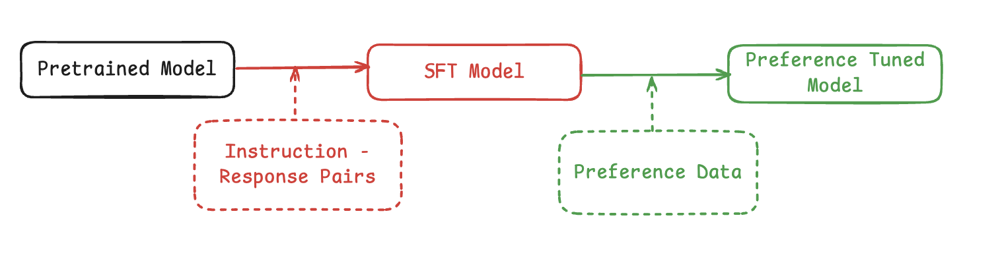

# GRPO

This tutorial is designed to help provide as comprehensive a guide as possible to help people just getting started with GRPO get a reasonably good grasp of the basics. It is not intended to be used for actual GRPO-RL tuning, but rather a starting point for those who are trying to learn. At TARESCO, we've been working on improving math capabilities of language models for low-resource languages across different parallels/configurations and we have found relative success with GRPO. This tutorial is a result of our work and is intended to be a starting point for those who are trying to learn. We hope that this tutorial will help you get started with GRPO.

There are lots of awesome tutorials that show how to implement GRPO from scratch and we have used some of them as references to creating this documentation. We specifically wanted this to be a perfect blend of oversimplification and complexity.


[Weight and Biases Training Report]()
An interesting thread on [practical tips when implementing GRPO](https://gist.github.com/willccbb/4676755236bb08cab5f4e54a0475d6fb#file-grpo_demo-py-L90)

## Table of Contents

- [High level understanding to RL and GRPO](#introduction)
- [Setup](#setup)
- [Data Structure and Requirements](#data-structure-and-requirements)
- [System Requirements](#system-requirements)
- [Generating Completions](#generating-completions)
- [Reward Function](#reward-function)
- [Regularization](#regularization)
- [References](#references)

## Introduction

To get a very detailed of the origins of GRPO and how it relates to other preference based RL methods like PPO and DPO, please refer to the [RLHF Book](https://rlhfbook.com/) and the [original GRPO paper (Deepseek Math)](https://arxiv.org/pdf/2402.03300).

At a very high level, LLM training setups there are 3 major stages of training to get to the final model, and they are pretraining, supervised fine-tuning (SFT) and reinforcement learning from human feedback (RLHF). Although in practice it is much more complicated than this with many many rounds of supervised finetuning and applying different RL algorithms to get to the final model.

<details>
  <summary> Excerpt from Cohere Command-A Report on a Complex Model training Pipeline </summary>
  
    ```
    Case in point:

    Command-A Technical Report:  Command A is an agent-optimised and multilingual-capable model,with support for 23 languages of global business, and a novel hybrid architecture balancing efficiency with topof the range performance. It offers best-in-class Retrieval Augmented Generation (RAG) capabilities withgrounding and tool use to automate sophisticated business processes. These abilities are achieved througha decentralised training approach, including self-refinement algorithms and model merging techniques. 
    ```
</details>
<br/>



Getting into GRPO proper, 

## References 

- [DeepSeekMath: Pushing the Limits of MathematicalReasoning in Open Language Models](https://arxiv.org/pdf/2402.03300)
- [The RLHF Book by Nathan Lambert](https://rlhfbook.com/)
- [Huggingface Documentation on GRPO](https://huggingface.co/docs/trl/main/en/grpo_trainer#looking-deeper-into-the-grpo-method)
- [Understanding R1-Zero-Like Training: A Critical Perspective](https://github.com/sail-sg/understand-r1-zero)
- [Tiny GRPO](https://github.com/fangyuan-ksgk/Tiny-GRPO)


###Steps

- Dataset Creation
  - Question and Answer Pairs